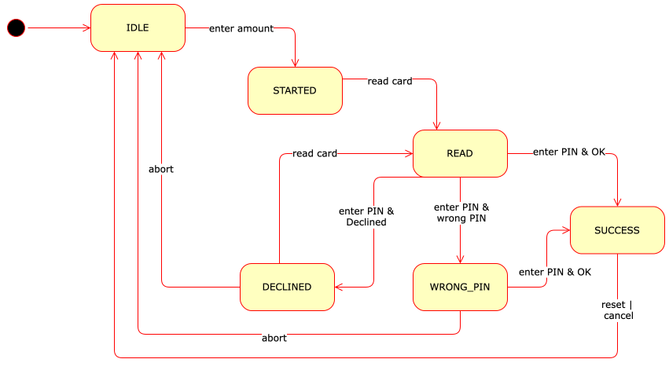

# Punto Vendita

Scrivi un software di base per orchestrare un dispositivo Punto Vendita (POS) in grado di leggere una carta di credito e effettuare una transazione di pagamento interagendo con un servizio gestore della carta di credito.

Tutti i problemi vengono notificati tramite l'eccezione `PosException`.

## R1 - Configurazione

La classe principale `PosApp` è pensata per essere chiamata da un'interfaccia utente.

Nella fase di configurazione, è possibile registrare le informazioni relative al commerciante, che utilizza il POS tramite il metodo `setMerchantInfo()`, e che accetta tre righe di testo che devono essere più corte di 20 caratteri ed essere non `null`; viene lanciata un'eccezione se le righe di testo non sono conformi.

Il metodo `getMerchantInfo()` restituisce una stringa composta dalle tre righe separate da `\n`.

A seconda del gestore della carta di credito devono essere utilizzati diversi server. Il metodo `registerIssuer()` registra un nuovo gestore (ad esempio, `"Visa"`) fornendo un nome del gestore della carta, un oggetto che implementa l'interfaccia Issuer, che viene utilizzato per completare il pagamento, e un elenco di Numeri di Identificazione del gestore (IIN). Secondo lo standard ISO/IEC 7812, l'IIN è l'elenco delle cifre iniziali di un numero di carta che permettono di identificare il gestore (ad esempio, Visa ha IIN `"4"`, Mastercard `"51","52","53","54","55"`).

È possibile recuperare il nome del gestore dato un numero di carta di credito utilizzando il metodo `getIssuer()`.

La data corrente può essere recuperata utilizzando il metodo `currentDate()` che viene inizializzata alla data corrente del computer. È possibile definire una data diversa (ad esempio, per scopi di test) utilizzando il metodo `setCurrentDate()`.

**NOTA**: non devi implementare l'interfaccia Issuer, i test forniranno un'implementazione mock utilizzata per scopi di test.

## R2 - Transazione semplice

Il POS funziona passando attraverso alcuni stati illustrati nel diagramma seguente.

Il POS è inizialmente nello stato `IDLE` da cui è possibile avviare una nuova transazione utilizzando il metodo `beginPayment()` che accetta l'importo da pagare e passa allo stato `STARTED`.

A questo punto, l'utente può strisciare la carta attraverso il lettore, che fa sì che venga chiamato il metodo `readStripe()`; il metodo riceve il numero della carta di credito (16 cifre), il nome del titolare della carta e la data di scadenza (4 cifre con formato MMYY, ad esempio 0924 significa settembre 2024). Il metodo, se ha successo, passa allo stato `READ` altrimenti diventa `DECLINED`.

Successivamente, l'utente deve inserire il PIN per procedere con il pagamento. Il metodo `performPayment()` accetta il PIN ed esegue il pagamento. Il pagamento viene effettuato chiamando il server associato al gestore della carta tramite il metodo `performPayment()`.

Il risultato della transazione restituito dal server determina cosa viene fatto dopo:

- se il codice del risultato è `OK`, lo stato diventa `SUCCESS` e il metodo restituisce l'ID della transazione
- se il codice del risultato è `WRONG_PIN`, lo stato diventa `WRONG_PIN` e il metodo lancia un'eccezione
- se il codice del risultato è `DECLINED`, `TIMEOUT`, o `ERROR`, lo stato diventa `DECLINED` e il metodo lancia un'eccezione

Dallo stato `WRONG_PIN` può essere inserito un nuovo PIN. 
Dallo stato `DECLINED` può essere strisciata una nuova carta.

## R3 - Transazione completa

Dopo una transazione riuscita è possibile tornare allo stato iniziale `IDLE` utilizzando il metodo `reset()`.

Dopo una transazione riuscita, è possibile annullare la transazione utilizzando il metodo `cancelTransaction()` che dovrebbe chiamare il metodo `cancelPurchase()` del server del gestore passando l'ID della transazione. Il metodo lancia un'eccezione se lo stato corrente non è `SUCCESS` o se il risultato dell'annullamento non è `OK`.

Durante una transazione (eccetto dopo un pagamento riuscito) è possibile abortire la transazione e tornare allo stato `IDLE` utilizzando il metodo `abortPayment()`.

## R4 - Statistiche

Il metodo `receipt()` restituisce una stringa contenente il testo della ricevuta con le seguenti informazioni:

* le informazioni del commerciante
* la data del pagamento
* le ultime 4 cifre del numero della carta di credito
* l'importo del pagamento
* il risultato del pagamento (`OK` o `ERROR`)
* l'ID della transazione

Le informazioni devono essere su righe separate.

Il metodo `transactionsByIssuer()` restituisce una mappa che ha come chiavi i gestori e come valori le liste di ID delle transazioni completate.

Il metodo `totalByIssuer()` restituisce una mappa che ha come chiavi i gestori e il totale relativo degli importi delle transazioni riuscite come valori.

## R5 - Controlli

Il metodo `readStripe()` deve verificare che la data di scadenza della carta di credito non sia passata; in caso la carta di credito sia scaduta, il metodo lancia un'eccezione e passa allo stato `DECLINED`.

Suggerimento: utilizza i metodi `getYear()` e `getMonthValue()` della classe `LocalDate`.
L'ultima cifra del numero della carta di credito è una cifra di parità calcolata utilizzando l'algoritmo di Luhn:

1. il payload consiste nelle prime 15 cifre (ovvero il numero della carta di credito senza l'ultima cifra di parità)
2. con il payload, inizia dalla cifra più a destra. Muovendosi a sinistra, raddoppia il valore di ogni seconda cifra (inclusa la cifra più a destra)
3. somma i valori delle cifre risultanti (ad esempio, 14 è 1 + 4 = 5)
4. la cifra di controllo è calcolata come (10 − (s mod 10)), dove s è la somma del passaggio precedente.

Esempio (con un numero di carta di credito di 4 cifre)

| Number   | 6      |  5  |  4    |  8     |
|----------|--------|-----|-------|--------|
| Step 1   | pl     | pl  | pl    | parity |
| Step 2   | 6*2=12 | 5   | 4*2=8 | -      |
| Step 3   | 3 =1+2 | 5   | 4     | -      |
| Step 4   | - | -  | -  | 8=10-(12%10) |

Il metodo `readStripe()` deve verificare che la cifra di parità calcolata corrisponda a quella presente nel numero della carta di credito; se non corrisponde, il metodo lancia un'eccezione e passa allo stato `DECLINED`.